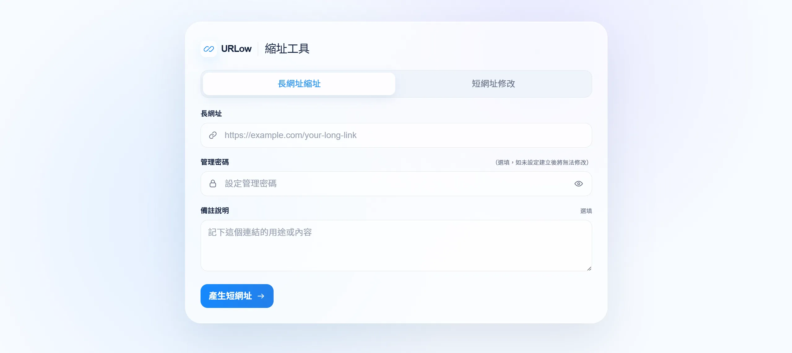

<div align="center">

# URLow
[urlow.mw7.workers.dev](https://urlow.mw7.workers.dev/)
### 部署在 Cloudflare Workers 的縮網址服務

 [API 文件](https://urlow.mw7.workers.dev/api-docs) · [開發文件](./docs/開發文件總覽.md)


</div>



URLow 可以建立、修改和停用短網址。建立時可選擇設定管理密碼及私人備註；開啟短網址後，Cloudflare Worker 會找到原始網址並回傳 `302 Redirect`。

## 可以做什麼

- 輸入 HTTP(S) 網址，產生 8 字元 Base62 短碼。
- 設定管理密碼後，可修改原始網址、備註及啟用狀態。
- 使用 Cloudflare KV 快取 Redirect 結果，查不到時再讀 PostgreSQL。
- 在 Swagger UI 查看 API request、response 和錯誤碼。
- 在桌面和手機上操作建立及修改流程。

## 架構

```text
瀏覽器
   │
   ▼
Cloudflare Worker（Nuxt Server）
   ├── 頁面與靜態檔案
   ├── API / Swagger UI
   └── 短網址 Redirect
             │
             ▼
        Cloudflare KV
             │ 找不到快取
             ▼
         Hyperdrive
             │
             ▼
       Neon PostgreSQL
```

| 技術 | 在專案裡負責什麼 |
| --- | --- |
| Nuxt 4、Vue 3、Tailwind CSS | 頁面、表單和 Server API |
| Cloudflare Workers | 執行網站、API 和 Redirect |
| Neon PostgreSQL、Drizzle ORM | 保存短網址與管理資料 |
| Cloudflare KV | 快取 Redirect 結果 |
| Cloudflare Hyperdrive | 連接 Worker 與 PostgreSQL |
| Zod、OpenAPI、Swagger UI | 驗證輸入和產生 API 文件 |
| Vitest、Vue Test Utils | 測試 Service、API 和畫面元件 |

## 實作時特別處理的問題

- PostgreSQL 是正式資料來源。KV 故障時，Redirect 仍會嘗試查資料庫。
- 資料庫有 unique constraint；若產生的短碼碰撞，最多重新產生五次。
- 管理密碼以 bcrypt 雜湊保存，API 不會回傳雜湊值。
- 管理密碼驗證有 Cloudflare Rate Limiting，避免短時間內重複嘗試。
- API 先用 Zod 驗證輸入，錯誤回應不包含 stack trace 或資料庫細節。
- 更新連結時會清除並重建 KV cache；API 也會回報這次同步是否成功。

## API

| Method | Path | 用途 |
| --- | --- | --- |
| `POST` | `/api/short-urls` | 建立短網址 |
| `GET` | `/api/short-urls/{code}/management` | 驗證密碼並讀取管理資料 |
| `PATCH` | `/api/short-urls/{code}` | 修改網址、備註或啟用狀態 |
| `GET` | `/{code}` | 前往原始網址 |
| `GET` | `/api/health/database` | 檢查資料庫連線 |
| `GET` | `/api/openapi.json` | 取得 OpenAPI JSON |

完整格式請看[線上 Swagger UI](https://urlow.mw7.workers.dev/api-docs)。

## 在本機執行

需要 Node.js 24 與 npm 10 以上版本。

```bash
git clone https://github.com/mountainway54/Urlow.git
cd Urlow
npm install
npm run dev
```

常用指令：

```bash
npm run test -- --run  # 跑測試
npm run typecheck      # 檢查 TypeScript 型別
npm run cf:dev         # 在本機啟動 Worker
npm run deploy         # 部署至 Cloudflare Workers
```

`cf:dev` 與部署需要 Neon PostgreSQL、Cloudflare 帳號和對應 bindings。設定方式與 rollback 步驟寫在[資料庫操作](./docs/資料庫操作.md)。

## 我怎麼使用 AI

我主要用 Codex 的 Grill Me 釐清需求，再交給 Spectra 管理規格、設計和工作項目。功能完成後，我會用 Postman 和瀏覽器手動測試，另開 Session 做獨立 Review；遇到不確定的判斷時，再請 Claude 交叉確認。

```text
Grill Me 釐清需求 → Spectra SDD → 手動測試 → 獨立 Review → 交叉確認
```

Spectra 的紀錄放在 `openspec/`。更完整的使用方式與實際 Prompt 收錄於 [AI 協作紀錄](./docs/AI協作紀錄.md)。

## 其他文件

- [架構設計與技術選型](./docs/架構設計與技術選型.md)
- [此專案的 KV 實作細節](./docs/此專案的KV實作細節.md)
- [專案使用的 Nuxt、TypeScript 與 Cloudflare 部署](./docs/專案技術與部署.md)
- [除錯紀錄](./docs/除錯紀錄.md)

## 授權

這是個人學習與作品集專案，目前沒有指定開源授權。
